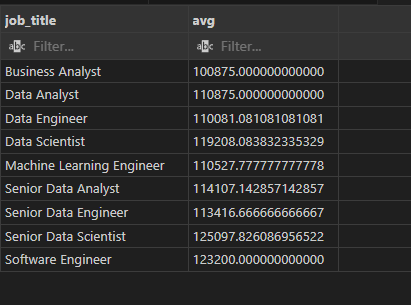
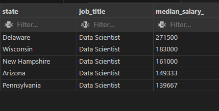
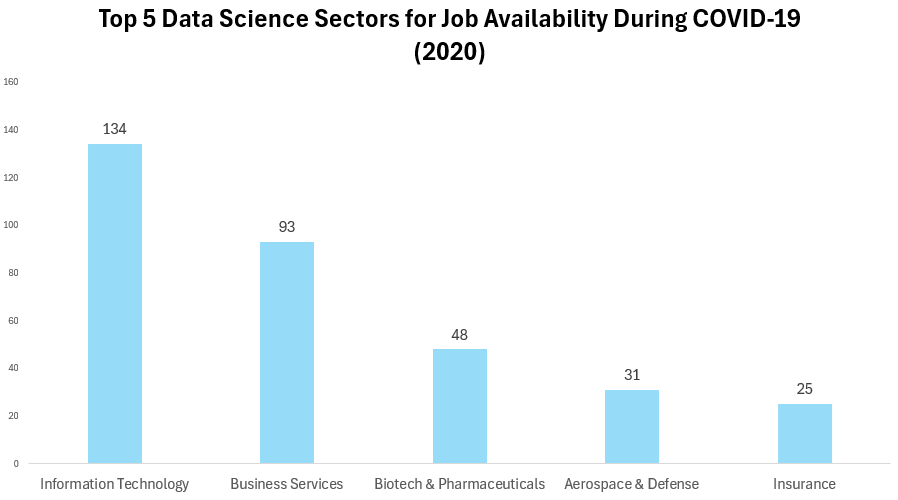
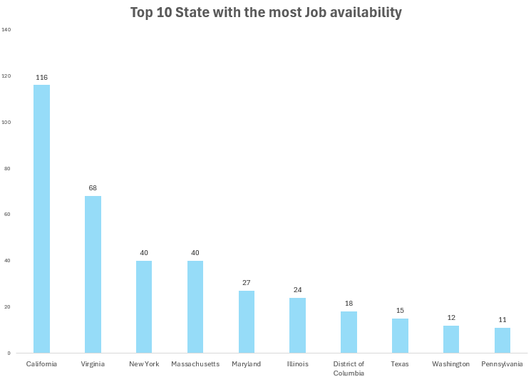
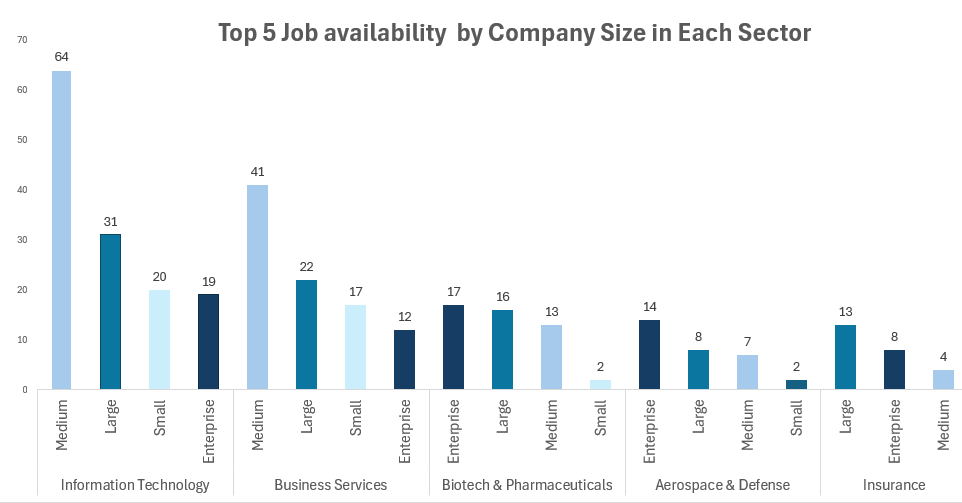
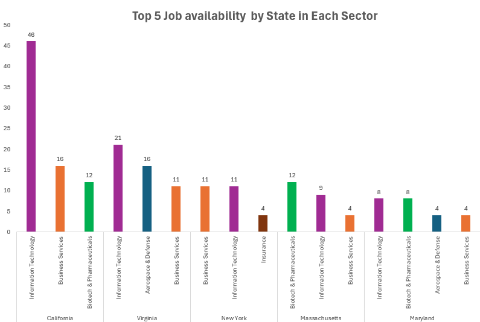
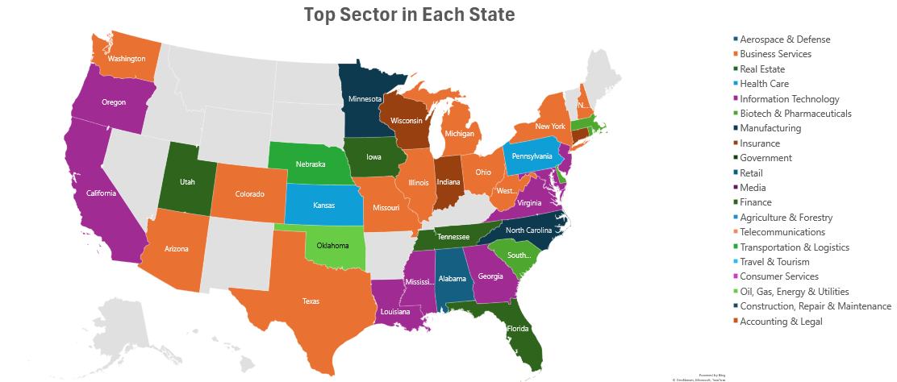

# Introduction
  This project will provide you with a quick look into job availability of data science roles 🧑‍🔬 in USA during COVID-19 (2020) 🦠, in this finding, I will use SQL for data Cleaning and data exploration tool and use Excel as  visualization tool. at the end of this project, you will be well informed of each state characteristic for data science roles and company size based on each sector.

# Background
The data we will be using, was retrieved form **Kaggle Dataset** , Kaggle is an online platform that serves as a community for data scientists and machine learning practitioners and recognized as one of the top resources for learning, sharing, and competing in data science.
  dataset that i will be looking into is **"Data Science Job Posting on Glassdoor"** And the reason why we used this dataset, was due to the following reason

    1.To find and insight into data science jobs, which field, role, state offer the highest salary
    2.To find sector or industry has the most job availability in data science role in order for job seekers to hone thier skill and knowledge accordingly.
    3.To hone my skill as a data analyst for data cleaning , data exploration , data Analysis  and data visualization.
   
   
The questions that we will be answering:

     1.Which sector has the most job available during COVID-19 (2020)?

     2.Which states has the most online job posting during the start of COVID-19 (2020)?

     3.What are proportion of company size for each sector?

     4.What are trend sector across each state in USA during COVID-19? 

# Limitation
1. Salary inaccuracy:  
The most important data for any job seeker in any field, must be salary data of each job. However, after data was cleaned , explored and prepared for data analysis. I notice that the salary data was inaccurate and cannot be use. 

 
  
*table 1 showing average salary group by job_title

 

*table 2 showing salary of top 5 data scientist in each state

From table 1 and table 2 you can see:
-Data Scientist had more salary than Senior Data Engineer
-Data Analyst had roughly the same salary and Data Engineer or Data Scientist
-The city that has the most highest cost of living in USA (e.g. California , Massachusetts ,New York,New Jersey )

This is very too counterintuitive and very much deviate from the norm. So, I decided that i will not be using salary data as part of data analysis. the inaccuracy that occured maybe due to the fact that the original data was retrived in salary range, but we cleaned and use it in median salary or it might be due to Glassdoor data error. because Glassdoor was a self-report data website, even if they had some measurement regarding to data inaccuracy, this might not be enough.

2. Online Job Postings:   
Data comes from Glassdoor, which is skewed toward sectors and companies that are more digital and proactive in online job postings (e.g., IT, business services).

3.  Age of Data:  
The data being analyzed is from 4 years ago, specifically from 2020. As such, it may not fully represent current market conditions, trends, or demand for specific job roles in the biotech, data science, or other sectors.

4. Lack of Comparative Data:  
The dataset used in this analysis covers only one year (2020). Without data from subsequent years or earlier periods, it is impossible to assess trends over time. a comparison across multiple years would provide a more comprehensive view of job posting trends.


# Tools  

-SQL: Used for data exploration and cleaning. SQL allowed me to query, filter, and organize the data, ensuring it was structured properly for analysis.

-PostgreSQL: Served as the database management system, where all the data was stored and managed. It enabled efficient data retrieval and storage.

-Excel: Employed for data visualization. Excel was used to create clear and effective charts, graphs, and pivot tables to represent insights from the data.

-Visual Studio Code: Used for executing queries and editing SQL code. Visual Studio Code provided an intuitive environment for working with scripts and running queries efficiently.

-Git and GitHub: Used for version control, ensuring that all changes to the project were tracked. GitHub facilitated collaboration, code sharing, and maintaining a well-organized project history.

# The Analysis
The main focus of this analysis will be job availability across state and also the detail of which sector has the most job posting during COVID-19, and investigate further whether company size has an effect on recruitment during COVID-19 or not

**1. Which sector has the most job available during COVID-19 (2020)?**

 To identify which sector has the most job availability, I use count function and group by sector, this query will focus on Top 5 sector with the most job posting

``` SQL
SELECT sector, COUNT(job_title) 
FROM job_data_staging_2
WHERE sector IS NOT NULL
GROUP BY sector
ORDER BY COUNT(job_title)  DESC
LIMIT 5;
```


Analysis of Job Postings by Sector in the U.S. (2020)
Insights:
Total Job Postings: 414

Dominance of Information Technology (IT):

- The IT sector accounts for 134 jobs (32.37%) job postings, this is to be expected, Data science role as heavily related to IT and technologies. 

- Business Services Comes Second 93 jobs (22.46%): Business services, which include consulting and professional services, show the growing need for data-driven decision-making in various businesses to handle COVID-19.

- Biotech & Pharmaceuticals 48 jobs (11.59%) :The high demand in biotech and pharma reflects the sector's prominence during the pandemic (e.g., vaccine development, supply chain management for medical supplies).

- Aerospace & Defense 31 jobs (7.49%) :
Aerospace and defense also saw notable demand for data professionals, possibly tied to defense contracting and pandemic-related logistical needs.
Such as Operation Warp Speed (OWS) during COVID-19  aimed at accelerating the development, manufacturing, and distribution of COVID-19 vaccines, therapeutics, and diagnostics.


- Retail 6 jobs (1.45%) , Media 5  jobs (1.21%)  , and Travel & Tourism 2 jobs (0.48%)  saw significant declines in hiring during 2020 due to COVID-19 disruptions.
These sector was severely affected by COVID-19 lockdown adn that affect the number of job recruitment for these sectors.

- IT, Business Services, and Biotech were the dominant sectors for data-related roles in 2020, driven by digital transformation and pandemic-related needs.
Retail, Travel, and Media sectors were heavily impacted by COVID-19, showing reduced hiring.


**2. Which states has the most online job posting during the start of COVID-19 (2020)?**

  -to identify which state has the most job availabiltity during COVID-19 and do big state or state with high cost of living (e.g. New York,Massachesetts,California,New Jersey) has the most job availability during challenging time like COVID-19 or not?

``` SQL
 SELECT state , COUNT(job_title) 
FROM job_data_staging_2
GROUP BY state
ORDER BY COUNT(job_title)  DESC
LIMIT 10;
```


Insights:

California (CA) leads significantly:
California, with 116 job postings (29.74%) , is far ahead of other states, accounting for nearly 30% of the total jobs listed.
This is likely due to the presence of Silicon Valley (Meta , Google , Mircrosoft etc.)and its tech ecosystem, which drives demand for data-related roles.

Virginia (VA) is second:
Virginia has 68 job postings  (17.44%),  home to government contractors, defense, and IT-related industries including Boeing ,Amazon Web Services (AWS)

New York (NY) and Massachusetts (MA) tied for third:
Both states have 40 job postings   (10.26%) each:
NY: A financial hub with a strong demand for data professionals in finance and banking.
MA: Boston's tech, healthcare, and education industries are key drivers these including company like Moderna , Takeda etc.
Maryland (MD), Illinois (IL), and Washington D.C. follow:
Maryland 27 job postings (6.92%), Illinois 24 job postings  (6.15%) , and Washington D.C. 18  job postings (4.62%) also show significant job opportunities, reflecting their roles in healthcare, government, and urban tech hubs.

3 of the top 5 states with the most highest cost of living (California,New York,Massachusetts) according to
 (Visual Capitalist. (2023). Mapped: The 10 U.S. states with the highest cost of living. Visual Capitalist. https://www.visualcapitalist.com/mapped-the-10-u-s-states-with-the-highest-cost-of-living/#google_vignette)
This show that there might be a relation of job availability and cost of living in each state


**3. What are proportion of company size for each sector?**

provide an insight into the compostion of company business size for each sector

Company size were divided into 4 size:  
Tier 1 (Small) 1–50  
Tier 2 (Medium) 51–500  
Tier 3 (Large) 501–5,000  
Tier 4 (Enterprise) 5,001+


``` SQL
SELECT sector,size ,COUNT(job_title) AS count,  DENSE_RANK() OVER (PARTITION BY sector ORDER BY COUNT(job_title) DESC) as ranking
FROM job_data_staging_2
WHERE sector IS NOT NULL AND size IS NOT NULL
GROUP BY sector,size
ORDER BY sector ,COUNT(job_title)  DESC
```


Sector Dominance Across Sizes
- Information Technology (IT): Dominates across all company sizes, with 64 (Medium), 31 (Large), 20 (Small), and 19 (Enterprise) postings.
IT's resilience and growth are driven by the pandemic's digital transformation needs.

- Business Services: Second most prominent, with 41 (Medium), 22 (Large), and 17 (Small) postings.
Reflects companies’ needs for data-driven decision-making and consulting during COVID-19 disruptions.
- Biotech & Pharmaceuticals: A high number of postings, particularly 17 (Enterprise), 16 (Large), and 13 (Medium), showcase the sector’s importance in vaccine development, supply chain optimization, and healthcare solutions.

- Government, Health Care, and Finance:Steady demand across company sizes reflects their critical roles during the pandemic.
Government and Finance primarily hired at Enterprise and Large levels, while Health Care hiring extended to smaller companies.
Lagging Sectors:

- Sectors like Retail, Travel & Tourism, Agriculture, and Non-Profit show minimal job postings, highlighting COVID-19's significant impact on these industries.
- In sectors like IT or Business service: company that is the most active in job recruitment were Medium and Large compny size. However, in field like Biotech, Aerospace and Insurance the most active size were either Large or Enterprise company, this was due to :
  - Medium and large companies in IT and Business Services were more active in recruitment during COVID-19 due to their ability to rapidly adapt to digital transformation and remote work demands. 
  - large and enterprise companies in Biotech, Aerospace, and Insurance were more active in recruitment because they had the necessary resources to scale up efforts focused on specialized roles and long-term projects.

**4. What are trend sector across each state in USA during COVID-19?**
- this query will look into majority of job industry across each state in USA.

``` SQL
SELECT state ,sector ,COUNT(job_title), DENSE_RANK() OVER (PARTITION BY state ORDER BY COUNT(job_title) DESC) as ranking
FROM job_data_staging_2
WHERE sector IS NOT NULL AND size IS NOT NULL
GROUP BY state ,sector
ORDER BY state ,COUNT(job_title)  DESC
```



``` SQL
WITH state_sector_cte AS(
 SELECT state ,sector ,COUNT(job_title), DENSE_RANK() OVER (PARTITION BY state ORDER BY COUNT(job_title) DESC) as ranking
FROM job_data_staging_2
WHERE sector IS NOT NULL AND size IS NOT NULL
GROUP BY state ,sector
ORDER BY state ,COUNT(job_title)  DESC
)
SELECT *
FROM state_sector_cte 
WHERE ranking =1
ORDER BY count DESC
```


Top Sectors by Demand:

1. Information Technology leads in nearly every state, highlighting its role in pandemic-driven transformation.  
2. Biotech & Pharmaceuticals ranks high in states like Massachusetts, Maryland, and California, reflecting healthcare innovations.  
3. Business Services is a versatile sector, contributing across diverse states.

Geographical Leaders:  
1. California, Virginia, and New York lead in job postings due to their established ecosystems in tech, defense, and finance.
2. Maryland and Massachusetts showcase the impact of specialized industries like biotech and defense.

Impact of the Pandemic:  
-IT, healthcare, and biotech grew in demand, while sectors like Retail, Travel, and Real Estate showed lower activity.

# What I Learned
 In this journey, there maybe some unexpected variable but I learn a lot from this project
- **Basic Data Cleaning 🧹** : Remove duplicate by using window function (ROW_NUMBER with PARTITION BY) , Standardize data using function like REGEXP_REPLACE , REPLACE ,SPLITPART ,  SUBSTRING FROM + POSITION IN, remove null value/missing value by impute the data.
-  **Bias and Data Inaccuracy**: Became aware of Data inaaccuracy in the data and bias that came from it.
-  **Data Visualization in Excel**: Using PivotChart to make easy to digest Visualization on Excel.
-  **Github**: Using github for version control and as a project portfolio

# Conclusion

The data highlights the resilience and growth of specific industries (IT, Biotech, Healthcare) during the pandemic, alongside the struggles of others (Retail, Travel, Real Estate).
States with strong tech, healthcare, and defense ecosystems were better positioned to maintain job availability during COVID-19.
Larger companies in specialized industries played a crucial role in addressing pandemic-related challenges, while smaller companies faced greater struggles.
The analysis underscores the uneven economic impact of COVID-19 across industries, company sizes, and states, providing critical insights into workforce dynamics during a global crisis.
